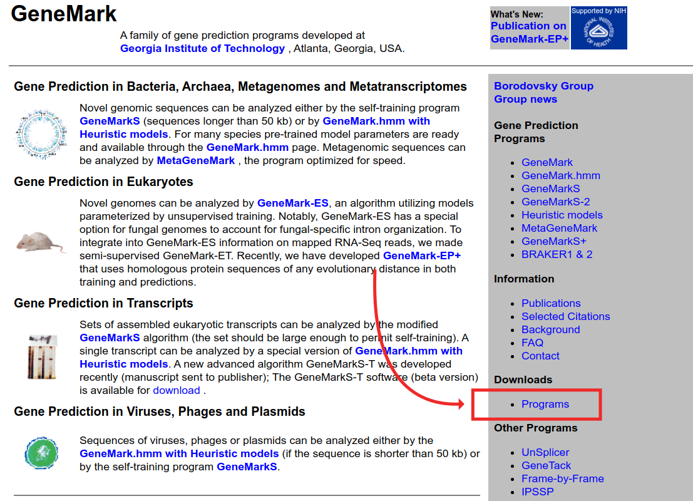
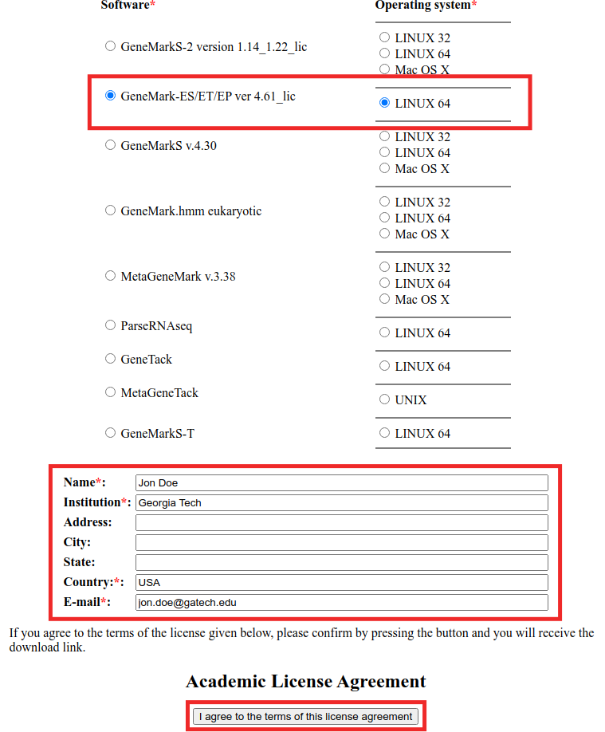
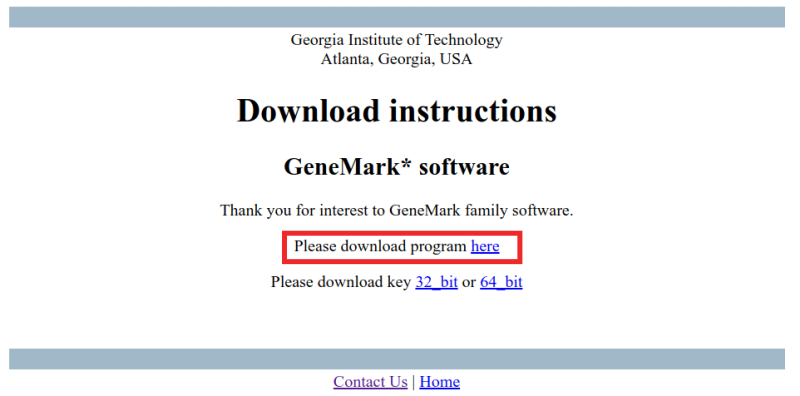

# Download

Visit [exon.gatech.edu](http://exon.gatech.edu/). Click "Programs" in the sidebar to navigate to the "Downloads" page:

?> The "Downloads page" is directly accessible at http://exon.gatech.edu/GeneMark/license_download.cgi.

Select `GeneMark-ES/ET/EP ver * - LINUX 64`, fill out the download form and agree to the license terms.

Download the software by clicking the download link:

?> **Key download:** GeneMark-ES Suite comes with a valid key, it is not necessary to download the key separately.